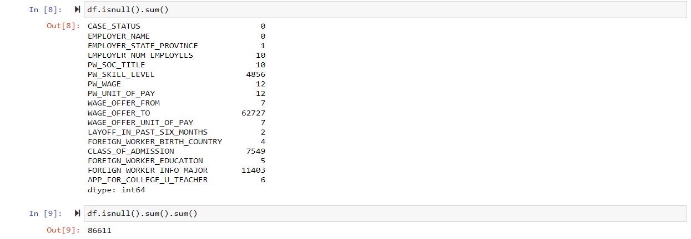

# H1-B_Prediction
A Data Analytics and Machine Learning project to predict the likelihood to be sponsored an H1-B Visa based on different factors

**ABSTRACT**

The United States employs most of the foreign workforce in the world. Despite that, to work in the United States legally, there are a series of procedures you must follow starting with filing your case. A case can be filed once a year thus failing to have the appropriate information can make you lose one year of work. Our goal for this project is to predict the case status of an application submitted by the employer to hire non-immigrant workers under the H-1B visa program. Employer can hire non-immigrant workers only after their LCA petition is approved. The approved LCA petition is then submitted as part of the Petition for a Non-immigrant Worker application for work authorizations  for  H-1B  visa  status.  We  want  to  uncover  insights  that  can  help  employers understand  the  process  of  getting  their  LCA  approved.  To  solve  this  problem,  we  use  a classification  approach  by  using  three  different  algorithms:  K-Nearest  Neighbors,  Logistic Regression and Decision Tree Classifier. The best algorithm was the logistic regression with 0.97 accuracy based on the features supplied. We believe that the algorithm can accurately classify if a file will be rejected or not hence saving a whole year for a foreign worker. 

**INTRODUCTION**

To work in the United States, foreign workers must get a work authorization known as work visa or H1-B visa. The first step is to have your employer file a case with you by giving a lot of information such as prevailing wage, name of the company, country of birth, etc... Then once this file is submitted, the Department of Labor analyzes it and determines if you are eligible to work or not in the United States. If your file is rejected, you will have the opportunity to send it only the next year which can have several consequences on your current status. For example, you might be a student on OPT and your OPT will soon expire. If that file is rejected, you will have to leave the United States before filing the case again which is more difficult when you are not close to your employer.  

What motivated me to complete this project is that as an international student, if I want to remain lawfully in the United States, one of the paths is to get a work visa. I will therefore have to petition a case to the Department of Labor. To maximize my chances and the chances of other international students, I decided to build a classifier based on the knowledge I received from my Data Mining class.  

**METHODOLOGY**

The  data  mining  task  for  this  project  is  **Classification**  and  the  techniques  used  to accomplish it are **Decision Tree Classifier, Logistic Regression and K-Nearest Neighbors.**  

**Decision Tree** is a Supervised Machine Learning Algorithm that uses a set of rules to make decisions, similarly to how humans make decisions. 

**Logistic regression** estimates the probability of an event occurring, such as Denied or Accepted, based on a given dataset of independent variables. It uses a function called the **sigmoid** 

**function** expressed as  ( )  =  1

1+ −

**The k-nearest neighbors algorithm,** also known as **KNN** or **k-NN,** is a non-parametric, supervised learning classifier, which uses proximity to make classifications or predictions about the grouping of an individual data point. 

**EXPERIMENTS**

We set up first our environment using **Jupyter Notebook** and **Python.** We will import some useful libraries such as **pandas** for preprocessing**, seaborn** for data visualization**, and sklearn** for the machine learning tasks. 

We load the dataset from the official website of the Department of Labor:  

<https://www.dol.gov/agencies/eta/foreign-labor/performance>

We first must determine the number of records and columns our dataset is made of. With pandas, we found out, our dataset has **100368** rows and **154** columns. Our data frame is therefore highly  dimensional,  and  we  must  reduce  the  features. 

One method would be to use **Principal Component Analysis** but the features are mostly categorical data or date type so we will reduce them based on business knowledge. All the information on the different attributes can be found on the Department of Labor website: 

[https://www.dol.gov/sites/dolgov/files/ETA/oflc/pdfs/LCA_Record_Layout_FY2022_Q1.pdf ](https://www.dol.gov/sites/dolgov/files/ETA/oflc/pdfs/LCA_Record_Layout_FY2022_Q1.pdf)The features we decide to work on are: 

**CASE\_STATUS:** The class to predict. Nominal Data**                

**EMPLOYER\_NAME:** Nominal Data               **EMPLOYER\_STATE\_PROVINCE:** Nominal Data          **EMPLOYER\_NUM\_EMPLOYEES:** Nominal Data           **PW\_SOC\_TITLE:** Nominal Data                     **PW\_SKILL\_LEVEL:** Nominal Data**                   

**PW\_WAGE:** Numeric**                          

**PW\_UNIT\_OF\_PAY:** Nominal Data                   **WAGE\_OFFER\_FROM:** Numeric                  **WAGE\_OFFER\_TO:** Numeric                    **WAGE\_OFFER\_UNIT\_OF\_PAY:** Nominal **LAYOFF\_IN\_PAST\_SIX\_MONTHS:** Binary        **FOREIGN\_WORKER\_BIRTH\_COUNTRY:** Nominal Data     **CLASS\_OF\_ADMISSION:** Nominal Data               **FOREIGN\_WORKER\_EDUCATION:** Nominal Data         **FOREIGN\_WORKER\_INFO\_MAJOR:** Nominal Data        **APP\_FOR\_COLLEGE\_U\_TEACHER:** Binary**        

Based on those features, we now have to perform some **preprocessing** before diving into 

analysis. 

We first look for missing values. We discover that we have **86611** missing values. The features  with  the  most  missing  values  are  **WAGE\_OFFER\_TO,  PW\_SKILL\_LEVEL, CLASS\_OF\_ADMISSION, FOREIGN\_WORKER\_INFO\_MAJOR**.**  

- **WAGE\_OFFER\_TO** represents the upper bound of the wage an employer is willing to pay a foreign worker. If it is missing, then we can predict there was no range  in  the  wage.  We  fill  the  missing  values  with  the  same  values  as **WAGE\_OFFER\_FROM** 
- **PW\_SKILL\_LEVEL** determines the skill level needed for the job. Upon close examination, we see that when this value is missing, there is no particular skill level necessary. We fill it with **None**. 

When we cannot fill the missing values, we just drop the rows containing them because the data are mostly **categorical(nominal).** We cannot use conventional techniques to fill them like **interpolation, binning, filling with the mean or median.** We had to drop **23383** rows but we still had **75000** left to analyze.  

The  feature  **CASE\_STATUS**  has  four  values  in  the  dataset:  **Certified,  Certified-Expired, Withdrawn, Denied.** We want to do a binary classification between **Certified and Denied.** All the rows with values **Certified-Expired** are changed to **Certified.** We exclude the rows with values **Withdrawn** because we cannot ascertain the reason the file was withdrawn.  

The feature **PW\_SKILL\_LEVEL** can be converted to a numeric one because it looks like there is an order in it. We therefore use the formula to convert from **ordinal data** to **numeric data**. 

=  − 1 where R is the rank of the value and M is the total number of values. For example, the 

− 1

value **Level I** will be assigned the Rank 1, **Level II** the Rank II and so on until **Level IV.** M is therefore equal to 4. 

We then filter our data frame with the feature **APP\_FOR\_COLLEGE\_U\_TEACHER** which determines if the application is file for a University Teacher or not. For the scope of our project, we focus only on workers and not professors because they represent two different markets.  

Next, we convert the features **PW\_WAGE** to numeric by removing the sign “$”, performing some transformation then we create a new feature called  **YEARLY\_RATE** based on the features **PW\_WAGE and PW\_UNIT\_OF\_PAY** to standardize all the wages.  

After all this preprocessing, we are left with the features: 

**CASE\_STATUS:** The class to predict. Nominal Data**                

**EMPLOYER\_NAME:**  Nominal  Data               **EMPLOYER\_STATE\_PROVINCE:**  Nominal  Data          **EMPLOYER\_NUM\_EMPLOYEES:**  Nominal  Data           **PW\_SOC\_TITLE:**  Nominal  Data                     **PW\_SKILL\_LEVEL:** Numeric Data**  

**LAYOFF\_IN\_PAST\_SIX\_MONTHS:**  Binary        **FOREIGN\_WORKER\_BIRTH\_COUNTRY:**  Nominal  Data     **CLASS\_OF\_ADMISSION:**  Nominal  Data               **FOREIGN\_WORKER\_EDUCATION:**  Nominal  Data         **FOREIGN\_WORKER\_INFO\_MAJOR:** Nominal Data 

**YEARLY\_RATE:** Numeric 

With the preprocessing done, we start plotting some** graphs to get insight in the data. We focus on the file that are **denied.** We see that people from **India** are denied the most but it can be explained because they amount to 80% of the whole number of petitions. So there is no causation or correlation. 

` `The company having the most denied file is **WIPRO** and it fits another criterion which is the layoff criterion. It seems that if there is a recent layoff in a company, the file has more chances to be denied. This can be explained by the fact that the Department of Labor asks the employer not to jeopardize US citizens job in order to hire foreign workers for a cheaper wage.  

Now that we have insights with plots, we can dive in the classification process itself. Most classification algorithms work only with numeric data so we must find a way to convert our data to numeric. For binary, we can simply convert it to **0** and **1**. The real challenge is in our nominal data. Fortunately, Pandas has a clever way to do it. 

Let’s take the case of the feature **FOREIGN\_WORKER\_EDUCATION** having values: **Masters, Bachelors, Associate, Doctorate, High School, None.** We can encode each value in a bit string representing it. For example, **Masters** can be encoded to (1,0,0,0,0,0), **Bachelors** to (0,1,0,0,0,0) and so on. Pandas to that job automatically for us. 

We then use the Decision Tree classifier from the scikit library of python, and it draws a decision  tree  for  us  with  Gini  Index  at  each  node. 

We then split our data into Training Data and Test Data with proportion **70/30** and we use the logistic regression classifier of the library scikit. After that, we determine its accuracy and plot the confusion matrix. 

Finally, we standardize our values for the training and testing data by using Python Standard Scaler then we train our KNN. We then determine its accuracy based on **mean absolute error, mean squared error, root mean squared error.**

**RESULT AND DISCUSSION**

The decision tree in the above picture is too big and not readable because there are far too many  attributes  and  far  too  many  values  for  a  single  attribute.  A  feature  like **EMPLOYER\_NAME** can have as many values as the number of companies in the United States which is more than **10,000.** We have many features exhibiting that property such as the province, the title of the Job. Looking at that decision tree, it is even useless for us to try to test it because it is too computationally expensive. 

The logistic regression had a **0.97** accuracy for the testing data which is good. Logistic regression works better than the decision tree because logistic regression works well with numeric data even though we have high dimensionality.  

The KNN, just like logistic regression, works well with numeric data and just determines the proximity between existing points and a new point. By plotting the error of the different KNN, we have discovered that the optimal value of K was K = 5. 

**CONCLUSION**

This project helped us to consolidate our knowledge of data mining. Using different methods such as KNN, Decision Tree, and Logistic Regression, we have found means to help employers and international students to predict if their files will be **certified** or **denied** by the Department of Labor. The Decision Tree Classifier was not an appropriate algorithm to classify and therefore we shall use the Logistic Regression. As perspectives for this project, we expect to work with data related to University Professors we have excluded, also we hope to find ways to work with rows we have dropped by finding a mean to fill them 

**REFERENCES** 

- Jiawei Han, Micheline Kamber, Jian Pei, *Data Mining Concepts and Techniques*, 3rd Edition, 2012. 
- [https://www.ibm.com/topics/logistic-regression ](https://www.ibm.com/topics/logistic-regression)
- [https://www.ibm.com/topics/knn ](https://www.ibm.com/topics/knn)
- [https://www.w3schools.com/python/python_ml_preprocessing.asp ](https://www.w3schools.com/python/python_ml_preprocessing.asp)
8

